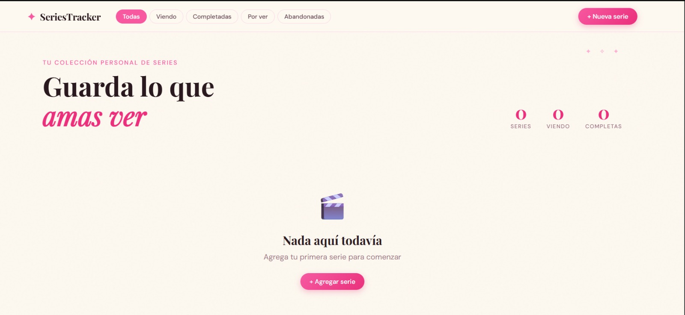

# 🎬 SeriesTracker — Backend

API REST construida en **Go** con **SQLite** como base de datos. Expone endpoints JSON para gestionar un tracker personal de series de TV. No genera HTML — solo devuelve datos.

---

## 🔗 Repositorios

| Repo | Link |
|------|------|
| 🎨 **Frontend** | `(todavía no)` |
| 🖥️ **Backend (este repo)** | `https://github.com/J05U3oAr/Proy-web-Backend` | 

---

##  Demo en vivo

En proceso

---

## 🚀 Cómo correr localmente

### Requisitos previos

- **Go 1.21+** → [descargar en golang.org/dl](https://golang.org/dl/)
- **GCC** (requerido por go-sqlite3):
  - **macOS:** `xcode-select --install`
  - **Linux (Ubuntu/Debian):** `sudo apt install gcc`
  - **Windows:** Instalar [MinGW-w64](https://www.mingw-w64.org/) y agregar al PATH

### Pasos

```bash
# 1. Clonar el repositorio
git clone https://github.com/J05U3oAr/Proy-web-Backend
cd series-tracker-backend

# 2. Descargar dependencias
go mod tidy

# 3. Correr el servidor
go run main.go
```

El servidor quedará escuchando en: **`http://localhost:8080`**

Puedes verificar que está corriendo visitando:
- `http://localhost:8080/health` → `{"status":"ok","service":"series-tracker-api"}`
- `http://localhost:8080/series` → `[]` (lista vacía al inicio)

---

## 📡 Endpoints de la API

### Series

| Método   | Ruta            | Descripción                        | Código éxito |
|----------|-----------------|------------------------------------|--------------|
| `GET`    | `/series`       | Listar todas las series            | `200 OK`     |
| `POST`   | `/series`       | Crear una serie nueva              | `201 Created`|
| `GET`    | `/series/:id`   | Obtener una serie por ID           | `200 OK`     |
| `PUT`    | `/series/:id`   | Editar una serie existente         | `200 OK`     |
| `DELETE` | `/series/:id`   | Eliminar una serie                 | `204 No Content` |
| `GET`    | `/health`       | Health check del servidor          | `200 OK`     |

### Códigos de error

| Código | Cuándo ocurre                              |
|--------|--------------------------------------------|
| `400`  | JSON inválido o campos que no pasan validación |
| `404`  | No existe una serie con ese ID            |
| `405`  | Método HTTP no permitido en esa ruta      |
| `500`  | Error interno del servidor                |

### Ejemplo de request y response

**POST /series**
```json
// Request body
{
  "title": "Breaking Bad",
  "genre": "Drama",
  "status": "completed",
  "episodes": 62,
  "description": "Un profesor de química se convierte en fabricante de metanfetamina.",
  "image_url": "https://m.media-amazon.com/images/M/MV5BMTJiMzgwZTktYzZhZC00YzhhLWEzZDUtMGM2NTE4MzQ4NGFmXkEyXkFqcGdeQWpybA@@._V1_.jpg"
}

// Response 201 Created
{
  "id": 1,
  "title": "Breaking Bad",
  "genre": "Drama",
  "status": "completed",
  "episodes": 62,
  "description": "Un profesor de química se convierte en fabricante de metanfetamina.",
  "image_url": "https://m.media-amazon.com/images/M/MV5BMTJiMzgwZTktYzZhZC00YzhhLWEzZDUtMGM2NTE4MzQ4NGFmXkEyXkFqcGdeQWpybA@@._V1_.jpg",
  "created_at": "2026-04-16T13:00:00Z",
  "updated_at": "2026-04-16T13:00:00Z"
}
```

**Error de validación 400**
```json
{
  "error": "validation_error",
  "message": "One or more fields are invalid",
  "fields": {
    "title": "Title is required and cannot be empty"
  }
}
```

---

## 📁 Estructura del proyecto

```
backend/
├── database/
│   └── database.go
├── handlers/
│   └── series.go
├── models/
│   └── models.go
├── go.mod
├── go.sum
├── main.go
└── Readme.md
```

---

## 🌐 CORS

CORS *(Cross-Origin Resource Sharing)* es una política de seguridad del navegador que bloquea peticiones `fetch()` hacia un origen distinto (diferente dominio o puerto) al de la página que las hace; el servidor debe permitirlas explícitamente mediante headers especiales.

En este proyecto configuramos lo siguiente para permitir que el frontend (en otro puerto) pueda consumir la API:

```
Access-Control-Allow-Origin: *
Access-Control-Allow-Methods: GET, POST, PUT, DELETE, OPTIONS
Access-Control-Allow-Headers: Content-Type, Authorization
```

---

## 🏆 Challenges implementados

- ✅ **Códigos HTTP correctos (20 pts)**
  - `201 Created` al crear una serie exitosamente
  - `204 No Content` al eliminar (sin body en la respuesta)
  - `404 Not Found` cuando el ID no existe en la base de datos
  - `400 Bad Request` cuando el JSON es inválido o falla la validación
  - `405 Method Not Allowed` cuando se usa un método HTTP no soportado
  - `500 Internal Server Error` ante fallos inesperados del servidor

- ✅ **Validación server-side con respuestas JSON descriptivas**
  - Respuesta estructurada con campo `fields` indicando exactamente qué campo falló y por qué

---

## 📸 Screenshot


---

## 💭 Reflexión

Usar **Go** para una API REST resultó ser una experiencia muy directa y satisfactoria. El lenguaje obliga a manejar errores explícitamente en cada paso, lo que hace el código predecible y fácil de depurar — si algo puede fallar, Go te obliga a decidir qué hacer con ese fallo en vez de ignorarlo silenciosamente como en otros lenguajes.

**SQLite** fue una elección práctica para este proyecto: no requiere instalación de servidor, el archivo de base de datos es portátil, y para el volumen de datos de un tracker personal es más que suficiente. Para una aplicación con múltiples usuarios concurrentes o miles de registros, migraría a **PostgreSQL**.

Lo más valioso del ejercicio fue entender la semántica HTTP real: la diferencia entre `200`, `201` y `204` parece trivial al principio, pero refleja contratos importantes — `201` dice "se creó un recurso nuevo", `204` dice "éxito pero no hay nada que devolverte". Esa precisión hace las APIs más predecibles para cualquier cliente que las consuma.

**¿Lo usaría de nuevo?** Sí, definitivamente para APIs pequeñas o medianas. Para proyectos más grandes exploraría frameworks como **Gin** o **Echo** que simplifican el routing.
