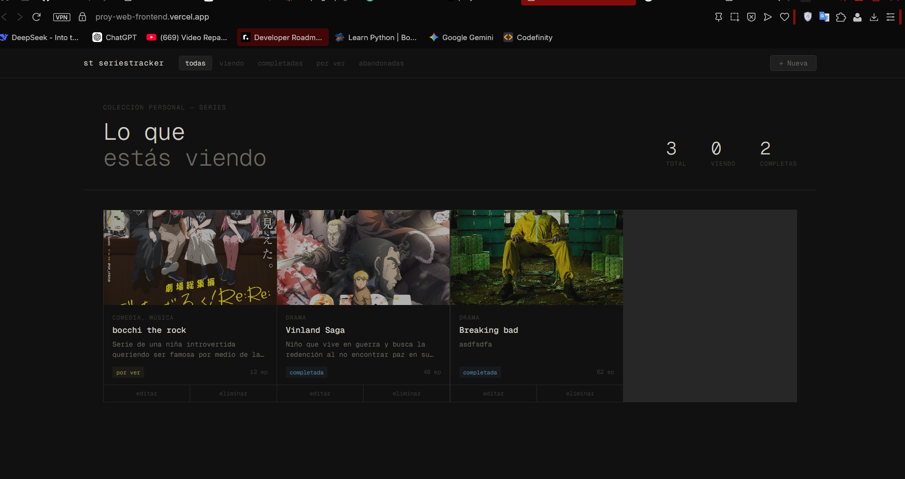

# SeriesTracker — Backend

API REST construida en **Go** con **SQLite** para gestionar una colección de series. Servidor HTTP independiente que expone únicamente JSON; no genera HTML.



> 🔗 Repositorio del frontend: [Proy-web-Frontend](https://github.com/J05U3oAr/Proy-web-Frontend)
> 🌐 Backend en producción: [web-production-42b2c.up.railway.app](https://web-production-42b2c.up.railway.app/health)

---

- **Go 1.21+**
- **SQLite** vía `modernc.org/sqlite` (sin CGO, sin GCC requerido)
- **`github.com/rs/cors`** para manejo de CORS

---

## Correr localmente

```bash
git clone <url-del-repo>
cd backend
go run main.go
```

El servidor queda disponible en `http://localhost:8080`.

### Variables de entorno

| Variable | Descripción | Default |
|---|---|---|
| `PORT` | Puerto HTTP | `8080` |
| `DATABASE_PATH` | Ruta del archivo SQLite | `./series.db` |
| `ALLOWED_ORIGINS` | Orígenes CORS separados por coma | `*` |

Ejemplo de `.env` local:

```env
PORT=8080
DATABASE_PATH=./series.db
ALLOWED_ORIGINS=http://localhost:3000
```

---

## Endpoints

| Método | Ruta | Descripción | Status |
|---|---|---|---|
| `GET` | `/health` | Health check | 200 |
| `GET` | `/series` | Listar todas las series | 200 |
| `POST` | `/series` | Crear una serie nueva | 201 |
| `GET` | `/series/:id` | Obtener una serie por ID | 200 / 404 |
| `PUT` | `/series/:id` | Editar una serie existente | 200 / 404 |
| `DELETE` | `/series/:id` | Eliminar una serie | 204 / 404 |

### Ejemplo de respuesta — `GET /series/:id`

```json
{
  "id": 1,
  "title": "The Wire",
  "genre": "Drama",
  "status": "completed",
  "episodes": 60,
  "description": "Serie policial de Baltimore.",
  "image_url": "https://...",
  "created_at": "2025-01-01T00:00:00Z",
  "updated_at": "2025-01-01T00:00:00Z"
}
```

### Códigos HTTP implementados

- `200` — OK
- `201` — Created (al crear una serie)
- `204` — No Content (al eliminar)
- `400` — Bad Request (input inválido o JSON malformado)
- `404` — Not Found (serie no existe)
- `405` — Method Not Allowed

---

## Validaciones server-side

El endpoint `POST /series` y `PUT /series/:id` validan:

- `title` — obligatorio, no puede estar vacío
- `status` — debe ser uno de: `watching`, `completed`, `plan_to_watch`, `dropped`
- `episodes` — no puede ser negativo

Los errores regresan como JSON descriptivo:

```json
{
  "error": "validation_error",
  "message": "One or more fields are invalid",
  "fields": {
    "title": "Title is required and cannot be empty"
  }
}
```

---

## CORS

CORS (Cross-Origin Resource Sharing) es una política de seguridad del navegador que bloquea peticiones entre orígenes distintos. Se configuró usando `github.com/rs/cors` para permitir que el frontend (corriendo en otro dominio/puerto) pueda consumir la API. En producción se define `ALLOWED_ORIGINS` con la URL exacta del frontend.

---

## Despliegue en Railway

1. Sube el backend a un repositorio de GitHub.
2. Crea un proyecto en Railway desde ese repositorio.
3. En el servicio configura `Root Directory = backend` (si está en un monorepo).
4. Agrega un **Volume** montado en `/data`.
5. Define las variables de entorno:
   ```
   DATABASE_PATH=/data/series.db
   ALLOWED_ORIGINS=https://proy-web-frontend.vercel.app
   ```
6. Railway usará el `railway.toml` incluido para compilar y levantar el servidor.
7. Verifica en `https://web-production-42b2c.up.railway.app/health`.

> **Nota:** Se usa `go build -o server . && ./server` en lugar de `go run` para evitar que el healthcheck falle mientras Go compila.

---

## Challenges implementados

- ✅ Códigos HTTP correctos en toda la API (201, 204, 400, 404, 405)
- ✅ Validación server-side con respuestas de error en JSON descriptivas
- ✅ Organización del código en paquetes separados (`handlers`, `models`, `database`)

---

## Reflexión

Usamos Go por su rendimiento y simplicidad para construir servidores HTTP. La librería estándar `net/http` es suficientemente poderosa sin necesidad de frameworks. `modernc.org/sqlite` fue una excelente elección porque compila sin CGO, lo que simplifica mucho el proceso en Railway. Lo usaríamos de nuevo sin dudarlo, aunque para proyectos más grandes evaluaríamos PostgreSQL para aprovechar mejor la concurrencia.